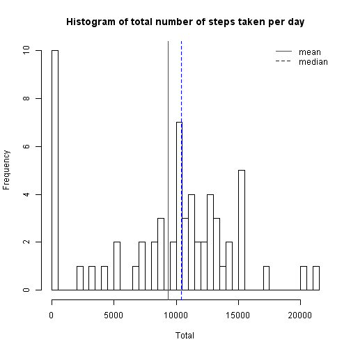
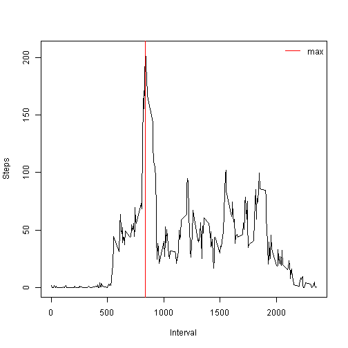
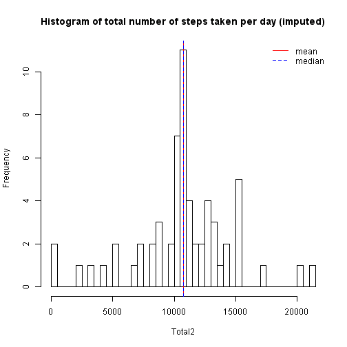
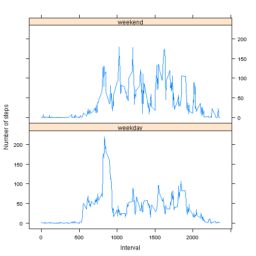

# Reproducible Research: Peer Assessment 1


## Loading and preprocessing the data

The necessary libraries are loaded. 

Data within the zip file is read and stored cases with complete data and data1 with all records including data gaps "__"NA"__".


```r
library(lattice)
Sys.setlocale("LC_TIME", "US")
```

```
## [1] "English_United States.1252"
```

```r
temp <- "~/GitHub/RepData_PeerAssessment1/activity.zip"
data <- read.csv(unz(temp, "activity.csv"))
rm(temp)
data$date <- as.Date(data$date, format = "%Y-%m-%d")
```


## What is mean total number of steps taken per day?

In this part of the calculations ignoring the empty values "__"NA"__".

Plot the histogram of all steps taken per day and calculated the mean and median of this total.


```r
Total <- with(data, tapply(steps, date, sum, na.rm = T))
hist(Total, main = "Histogram of total number of steps taken per day", breaks = 61)
abline(v = mean(as.numeric(Total)), col = "red")
abline(v = median(as.numeric(Total)), col = "blue", lty = 2)
# create legend data
legend("topright", lty = c(1, 2), col = c("red", "blue"), legend = c("mean", 
    "median"), box.lwd = 0, box.col = "transparent", bg = "transparent")
```

 

```r
# the average and the median is calculated.
mea <- mean(na.exclude(as.numeric(Total)))
med <- median(na.exclude(as.numeric(Total)))
options(scipen = 1, digits = 2)
```


> It was found that the average total steps per day is __9354.23__ and median steps per day is is __10395__.


## What is the average daily activity pattern?

A graph of a time series of the time intervals was performed every 5 minutes (x axis) and the average number of steps taken to every day (y-axis)


```r
# calculate the average distance in each time interval
MeInt <- tapply(data$steps, data$interval, mean, na.rm = T)
int <- as.numeric(names(MeInt))
# plot
plot(int, MeInt, type = "l", xlab = "Interval", ylab = "Steps")
max <- as.numeric(names(MeInt)[MeInt == max(MeInt)])
# add a line where the maximum number of steps
abline(v = max, col = "red")
legend("topright", lty = c(1), col = c("red"), legend = c("max"), box.lwd = 0, 
    box.col = "transparent", bg = "transparent")
```

 


> With each 5-minute interval, along all the time assessed that interval contains the maximum number of steps and found that the 5-minute interval number __835__ is the one that contains the largest number of steps along every day.

## Imputing missing values


We calculated the total number of missing values in the data set.


```r
QtNas <- sum(is.na(data$steps))
```


The total number of missing data is  __2304__.

Proceed to implement a method that imputes values where found __"NA"__.

The method to implement is to impute data according to the characteristics of each empty data, ie:
is to fill each value __"NA"__ with previously calculated average value corresponding to the average for the respective 5-minute interval data to the empty part.

For this second part we proceed to work with the data set __data2__.


```r
data2 <- data
for (i in 1:dim(data)[1]) {
    if (is.na(data2$steps[i])) {
        data2$steps[i] <- as.numeric(MeInt[names(MeInt) == data2$interval[i]])
    }
}
```


A histogram of the total number of steps taken per day and the average and the average of this measure calculation was performed.


```r
Total2 <- with(data2, tapply(steps, date, sum))
hist(Total2, main = "Histogram of total number of steps taken per day (imputed)", 
    breaks = 61)
abline(v = mean(as.numeric(Total2)), col = "red")
abline(v = median(as.numeric(Total2)), col = "blue", lty = 2)
# create legend data
legend("topright", lty = c(1, 2), col = c("red", "blue"), legend = c("mean", 
    "median"), box.lwd = 0, box.col = "transparent", bg = "transparent")
```

 

```r
me2 <- mean(as.numeric(Total2))
med2 <- median(as.numeric(Total2))
```


> average total steps per day is __10766.19__  and median steps per day is __10766.19__.

> It was observed that there are differences with respect to the first part of the assignment, as both the histogram graph changes to have more number of observations at certain intervals. 

> additionally found that varied the values of the mean and the median to make the imputation of the data, it was observed that even the median and average end up being the same in the case of including the imputed data analysis.


## Are there differences in activity patterns between weekdays and weekends?


Proceeds to generate an additional variable called week which is a factor that serve to differentiate between the days in weekdays and weekend.


```r
w <- weekdays(data2$date)
w[w == "Sunday"] <- "weekend"
w[w != "weekend"] <- "weekday"
data2$Week <- as.factor(w)
```


A graphic panel containing 2 time series where the x axis are intervals of 5 minutes to make, and the Y axis is the average number of steps along the days of weekdays and weekend.


```r
steps_int <- aggregate(steps ~ interval + Week, data = data2, mean)
xyplot(steps ~ interval | Week, type = "l", data = steps_int, layout = c(1, 
    2), xlab = "Interval", ylab = "Number of steps")
```

 

